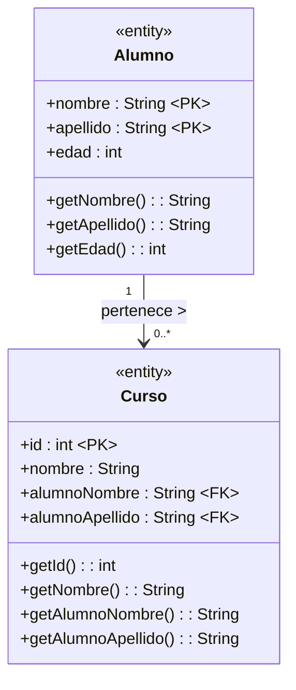
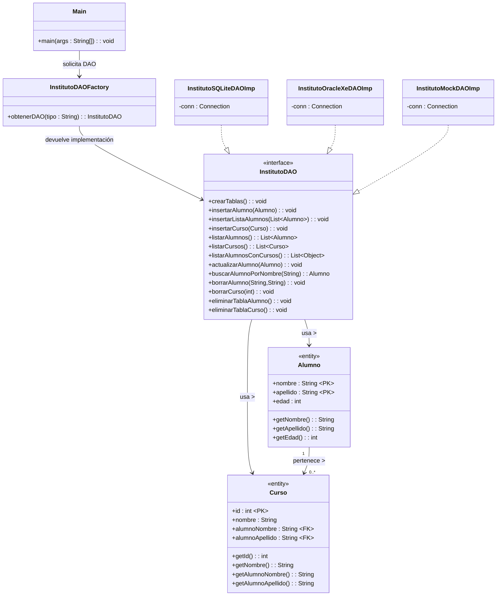

# Actividad Conectores

- **Nombre:** David Oliva Huelamo
- **Curso:** 2ºDAM

## Descripción del Proyecto

El usuario puede elegir trabajar con:

-**SQLite
-Oracle XE (Docker)
-Mock**

Una vez seleccionada la base de datos, el sistema ofrece un menu comun con todas las opciones disponibles.

## Funcionalidades Principales

### Gestión de Alumnos

- Crear la tabla de alumnos.
- Insertar un alumno.
- Insertar una lista de varios alumnos.
- Listar todos los alumnos.
- Buscar alumnos por nombre.
- Actualizar la edad de un alumno.
- Eliminar un alumno.
- Eliminar la tabla completa.

### Gestión de Cursos

- Crear la tabla de cursos.
- Insertar un curso asociado a un alumno.
- Listar todos los cursos.
- Listar alumnos junto con sus cursos.
- Eliminar un curso por su ID.
- Eliminar la tabla completa.

## Diagrama UML de las Tablas

## Diagrama UML del Proyecto

